# Design Document: AI Mentor Platform

## Overview

The AI Mentor Platform is a cloud-native, microservices-based system that provides personalized learning and developer productivity tools. The platform leverages AI/ML capabilities to deliver adaptive content, intelligent code assistance, and comprehensive progress tracking. Built on AWS infrastructure, the system is designed for scalability, security, and high availability.

### Key Design Principles

1. **Modularity**: Separate concerns into distinct services (Tutor, Code Assistant, Progress Tracker)
2. **Scalability**: Horizontal scaling capabilities for all services
3. **Security**: End-to-end encryption, secure authentication, and data isolation
4. **Adaptability**: ML-driven personalization based on user behavior and performance
5. **Performance**: Sub-2-second response times with caching and optimization
6. **Extensibility**: Well-defined APIs for future integrations and features

## High-Level Architecture

The system follows a microservices architecture with three core services:

- **Tutor Service**: Handles concept explanations, adaptive learning, quizzes, and recommendations
- **Code Assistant Service**: Provides code generation, debugging, optimization, and review capabilities
- **Progress Tracker Service**: Manages user metrics, dashboards, and analytics

### Technology Stack

- **Backend**: Node.js with Express.js (REST APIs)
- **AI/ML**: OpenAI GPT-4 API for natural language processing and code analysis
- **Database**: Amazon DynamoDB (NoSQL) for user data and progress
- **Authentication**: AWS Cognito for user management and JWT tokens
- **Hosting**: AWS Lambda (serverless functions) + API Gateway
- **Storage**: Amazon S3 for static assets and backups
- **Caching**: Amazon ElastiCache (Redis) for performance optimization
- **Monitoring**: AWS CloudWatch for logging and metrics


## System Architecture Diagram

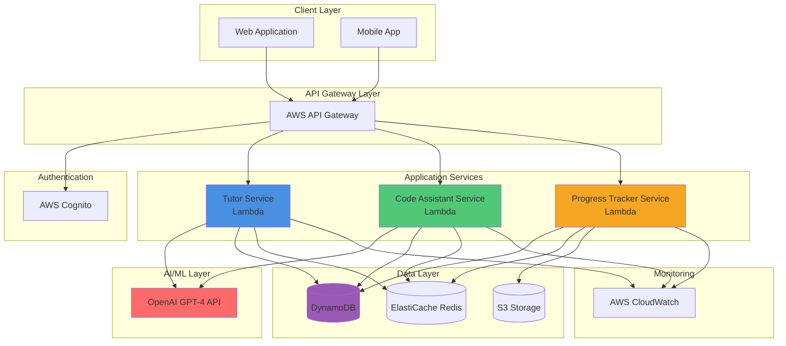


## Component Diagram

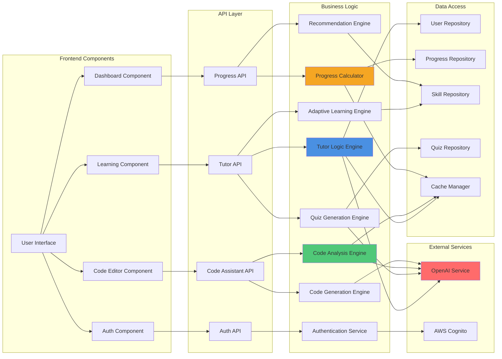


## Sequence Diagrams

### 1. User Learning Flow (Concept Explanation, Quiz, Feedback)

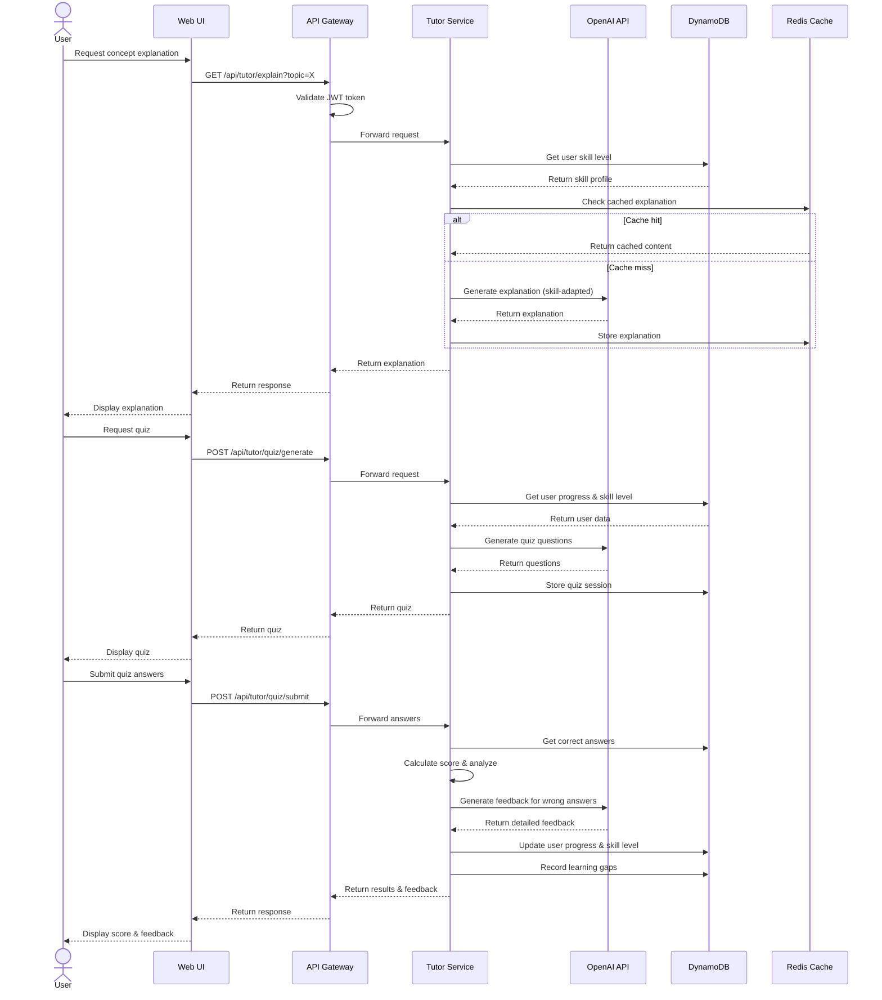


### 2. Code Assistance Flow (Write, Debug, Optimize, Review)

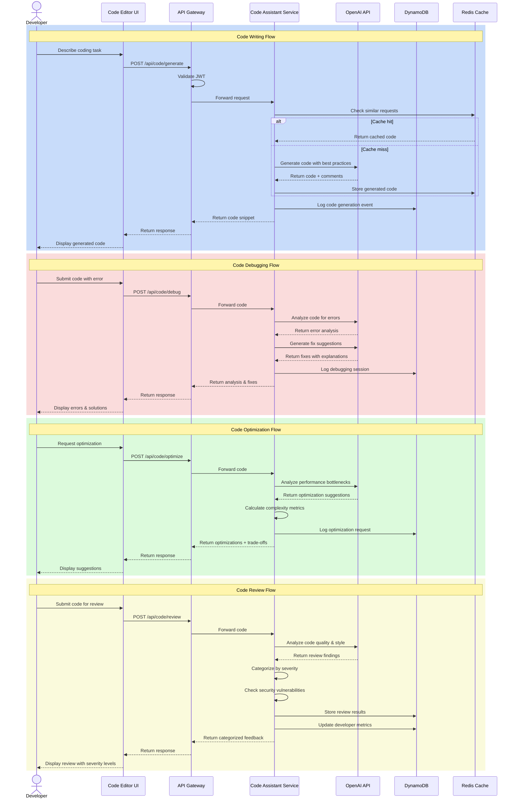


### 3. Progress Tracking Flow

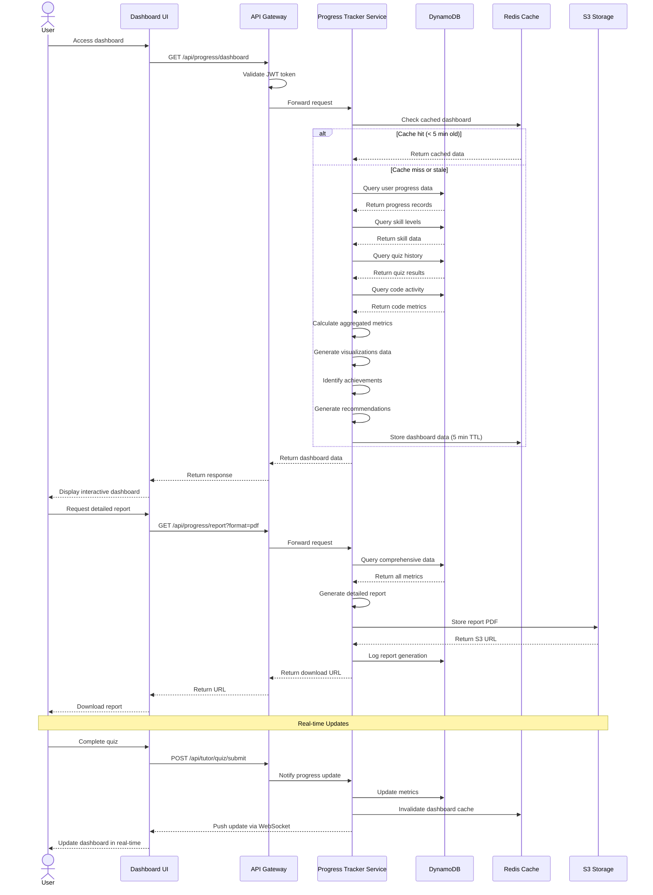


### 4. Authentication Flow

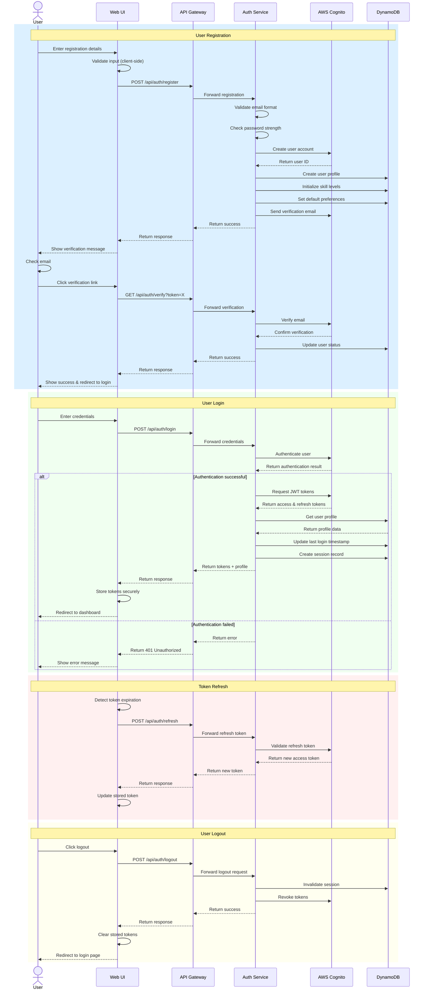


## Data Flow Diagram

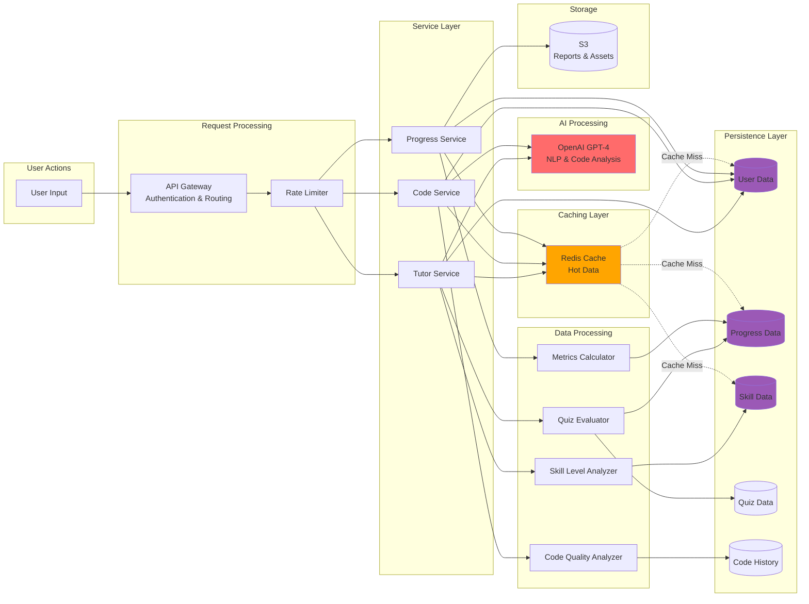


## Low-Level Design

### Components and Interfaces

#### 1. Tutor Service

**Responsibilities:**
- Concept explanation generation
- Adaptive content delivery
- Quiz generation and evaluation
- Learning gap detection
- Topic recommendations

**Key Classes/Modules:**

```typescript
// Tutor Service Core
class TutorService {
  explainConcept(userId: string, topic: string): Promise<Explanation>
  generateQuiz(userId: string, topic: string, difficulty: number): Promise<Quiz>
  evaluateQuiz(userId: string, quizId: string, answers: Answer[]): Promise<QuizResult>
  detectLearningGaps(userId: string): Promise<LearningGap[]>
  recommendNextTopic(userId: string): Promise<TopicRecommendation[]>
}

// Adaptive Learning Engine
class AdaptiveLearningEngine {
  assessSkillLevel(userId: string, topic: string): Promise<SkillLevel>
  adjustContentComplexity(content: string, skillLevel: SkillLevel): string
  updateSkillProfile(userId: string, performance: Performance): Promise<void>
}

// Quiz Generation Engine
class QuizEngine {
  generateQuestions(topic: string, count: number, difficulty: number): Promise<Question[]>
  evaluateAnswer(question: Question, answer: Answer): AnswerEvaluation
  generateFeedback(question: Question, answer: Answer, isCorrect: boolean): string
}

// Recommendation Engine
class RecommendationEngine {
  analyzePrerequisites(topic: string): string[]
  findOptimalPath(currentSkills: SkillProfile, targetTopic: string): LearningPath
  prioritizeLearningGaps(gaps: LearningGap[]): LearningGap[]
}
```

**API Endpoints:**

```
POST   /api/tutor/explain
POST   /api/tutor/quiz/generate
POST   /api/tutor/quiz/submit
GET    /api/tutor/gaps
GET    /api/tutor/recommendations
POST   /api/tutor/assess-skill
```


#### 2. Code Assistant Service

**Responsibilities:**
- Code generation from descriptions
- Debugging assistance
- Code optimization suggestions
- Automated code review

**Key Classes/Modules:**

```typescript
// Code Assistant Service Core
class CodeAssistantService {
  generateCode(description: string, language: string, context?: string): Promise<CodeSnippet>
  debugCode(code: string, error: string, language: string): Promise<DebugAnalysis>
  optimizeCode(code: string, language: string): Promise<OptimizationSuggestion[]>
  reviewCode(code: string, language: string): Promise<CodeReview>
}

// Code Analysis Engine
class CodeAnalysisEngine {
  analyzeComplexity(code: string, language: string): ComplexityMetrics
  detectAntiPatterns(code: string, language: string): AntiPattern[]
  checkSecurityVulnerabilities(code: string, language: string): SecurityIssue[]
  validateStyle(code: string, language: string, styleGuide: string): StyleViolation[]
}

// Code Generation Engine
class CodeGenerationEngine {
  parseDescription(description: string): CodeIntent
  generateImplementation(intent: CodeIntent, language: string): string
  addComments(code: string, intent: CodeIntent): string
  applyBestPractices(code: string, language: string): string
}

// Optimization Engine
class OptimizationEngine {
  identifyBottlenecks(code: string, language: string): Bottleneck[]
  suggestOptimizations(bottleneck: Bottleneck): Optimization[]
  calculateTradeoffs(optimization: Optimization): Tradeoff
}
```

**API Endpoints:**

```
POST   /api/code/generate
POST   /api/code/debug
POST   /api/code/optimize
POST   /api/code/review
GET    /api/code/history
```


#### 3. Progress Tracker Service

**Responsibilities:**
- User progress monitoring
- Dashboard data aggregation
- Metrics calculation
- Achievement tracking
- Report generation

**Key Classes/Modules:**

```typescript
// Progress Tracker Service Core
class ProgressTrackerService {
  getDashboard(userId: string): Promise<Dashboard>
  getDetailedMetrics(userId: string, timeRange: TimeRange): Promise<Metrics>
  generateReport(userId: string, format: ReportFormat): Promise<Report>
  trackEvent(userId: string, event: ProgressEvent): Promise<void>
}

// Metrics Calculator
class MetricsCalculator {
  calculateCompletionRate(userId: string): number
  calculateSkillGrowth(userId: string, timeRange: TimeRange): SkillGrowth[]
  calculateStreaks(userId: string): Streak
  identifyAchievements(userId: string): Achievement[]
}

// Dashboard Builder
class DashboardBuilder {
  aggregateMetrics(userId: string): AggregatedMetrics
  generateVisualizations(metrics: AggregatedMetrics): Visualization[]
  getRecentActivity(userId: string, limit: number): Activity[]
  getRecommendedActions(userId: string): Action[]
}

// Report Generator
class ReportGenerator {
  compileData(userId: string): ReportData
  formatReport(data: ReportData, format: ReportFormat): Buffer
  uploadToS3(report: Buffer, userId: string): Promise<string>
}
```

**API Endpoints:**

```
GET    /api/progress/dashboard
GET    /api/progress/metrics
GET    /api/progress/report
POST   /api/progress/event
GET    /api/progress/achievements
GET    /api/progress/activity
```


#### 4. Authentication Service

**Responsibilities:**
- User registration and verification
- Login and logout
- Token management
- Session management

**Key Classes/Modules:**

```typescript
// Authentication Service Core
class AuthenticationService {
  register(email: string, password: string, profile: UserProfile): Promise<User>
  verifyEmail(token: string): Promise<boolean>
  login(email: string, password: string): Promise<AuthResult>
  logout(userId: string, sessionId: string): Promise<void>
  refreshToken(refreshToken: string): Promise<TokenPair>
}

// Token Manager
class TokenManager {
  generateTokens(userId: string): TokenPair
  validateAccessToken(token: string): TokenPayload
  validateRefreshToken(token: string): TokenPayload
  revokeToken(token: string): Promise<void>
}

// Session Manager
class SessionManager {
  createSession(userId: string, metadata: SessionMetadata): Promise<Session>
  getSession(sessionId: string): Promise<Session>
  invalidateSession(sessionId: string): Promise<void>
  cleanupExpiredSessions(): Promise<number>
}
```

**API Endpoints:**

```
POST   /api/auth/register
GET    /api/auth/verify
POST   /api/auth/login
POST   /api/auth/logout
POST   /api/auth/refresh
POST   /api/auth/forgot-password
POST   /api/auth/reset-password
```


## Data Models

### Database Schema (DynamoDB)

#### Users Table

```typescript
interface User {
  userId: string;              // Partition Key (PK)
  email: string;               // GSI: email-index
  passwordHash: string;
  firstName: string;
  lastName: string;
  createdAt: string;          // ISO 8601 timestamp
  lastLoginAt: string;
  emailVerified: boolean;
  preferences: {
    learningGoals: string[];
    preferredLanguages: string[];
    notificationsEnabled: boolean;
  };
  status: 'active' | 'inactive' | 'suspended';
}
```

#### SkillProfiles Table

```typescript
interface SkillProfile {
  userId: string;              // Partition Key (PK)
  topic: string;               // Sort Key (SK)
  skillLevel: number;          // 0-100 scale
  lastAssessed: string;
  assessmentHistory: {
    timestamp: string;
    level: number;
    source: 'quiz' | 'self-assessment' | 'code-review';
  }[];
  masteryIndicators: {
    conceptUnderstanding: number;
    practicalApplication: number;
    problemSolving: number;
  };
  updatedAt: string;
}
```

#### Progress Table

```typescript
interface Progress {
  userId: string;              // Partition Key (PK)
  recordId: string;            // Sort Key (SK): timestamp#type
  type: 'quiz' | 'code' | 'learning' | 'achievement';
  timestamp: string;
  data: {
    // For quiz type
    quizId?: string;
    topic?: string;
    score?: number;
    questionsCorrect?: number;
    questionsTotal?: number;
    
    // For code type
    codeAction?: 'generate' | 'debug' | 'optimize' | 'review';
    language?: string;
    linesOfCode?: number;
    
    // For learning type
    conceptsLearned?: string[];
    timeSpent?: number;
    
    // For achievement type
    achievementId?: string;
    achievementName?: string;
  };
}
```

#### LearningGaps Table

```typescript
interface LearningGap {
  userId: string;              // Partition Key (PK)
  gapId: string;               // Sort Key (SK)
  topic: string;
  identifiedAt: string;
  severity: 'low' | 'medium' | 'high';
  description: string;
  prerequisiteTopics: string[];
  recommendedResources: {
    type: 'explanation' | 'quiz' | 'practice';
    title: string;
    url?: string;
  }[];
  status: 'open' | 'in-progress' | 'resolved';
  resolvedAt?: string;
}
```

#### Quizzes Table

```typescript
interface Quiz {
  quizId: string;              // Partition Key (PK)
  userId: string;              // GSI: userId-index
  topic: string;
  difficulty: number;          // 1-5 scale
  createdAt: string;
  questions: {
    questionId: string;
    questionText: string;
    options: string[];
    correctAnswer: number;
    explanation: string;
    difficulty: number;
  }[];
  status: 'pending' | 'completed';
  completedAt?: string;
  score?: number;
}
```

#### CodeHistory Table

```typescript
interface CodeHistory {
  userId: string;              // Partition Key (PK)
  recordId: string;            // Sort Key (SK): timestamp#action
  action: 'generate' | 'debug' | 'optimize' | 'review';
  language: string;
  timestamp: string;
  input: {
    description?: string;
    code?: string;
    error?: string;
  };
  output: {
    code?: string;
    analysis?: string;
    suggestions?: string[];
  };
  metadata: {
    tokensUsed: number;
    responseTime: number;
    cached: boolean;
  };
}
```

#### Sessions Table

```typescript
interface Session {
  sessionId: string;           // Partition Key (PK)
  userId: string;              // GSI: userId-index
  createdAt: string;
  expiresAt: string;
  lastActivityAt: string;
  ipAddress: string;
  userAgent: string;
  refreshToken: string;
  status: 'active' | 'expired' | 'revoked';
}
```


### DynamoDB Table Design

```mermaid
erDiagram
    USERS ||--o{ SKILL_PROFILES : has
    USERS ||--o{ PROGRESS : tracks
    USERS ||--o{ LEARNING_GAPS : identifies
    USERS ||--o{ QUIZZES : takes
    USERS ||--o{ CODE_HISTORY : creates
    USERS ||--o{ SESSIONS : maintains
    
    USERS {
        string userId PK
        string email GSI
        string passwordHash
        string firstName
        string lastName
        timestamp createdAt
        timestamp lastLoginAt
        boolean emailVerified
        object preferences
        string status
    }
    
    SKILL_PROFILES {
        string userId PK
        string topic SK
        number skillLevel
        timestamp lastAssessed
        array assessmentHistory
        object masteryIndicators
        timestamp updatedAt
    }
    
    PROGRESS {
        string userId PK
        string recordId SK
        string type
        timestamp timestamp
        object data
    }
    
    LEARNING_GAPS {
        string userId PK
        string gapId SK
        string topic
        timestamp identifiedAt
        string severity
        string description
        array prerequisiteTopics
        array recommendedResources
        string status
        timestamp resolvedAt
    }
    
    QUIZZES {
        string quizId PK
        string userId GSI
        string topic
        number difficulty
        timestamp createdAt
        array questions
        string status
        timestamp completedAt
        number score
    }
    
    CODE_HISTORY {
        string userId PK
        string recordId SK
        string action
        string language
        timestamp timestamp
        object input
        object output
        object metadata
    }
    
    SESSIONS {
        string sessionId PK
        string userId GSI
        timestamp createdAt
        timestamp expiresAt
        timestamp lastActivityAt
        string ipAddress
        string userAgent
        string refreshToken
        string status
    }
```


## API Endpoints

### Authentication API

| Method | Endpoint | Description | Auth Required |
|--------|----------|-------------|---------------|
| POST | `/api/auth/register` | Register new user | No |
| GET | `/api/auth/verify?token={token}` | Verify email address | No |
| POST | `/api/auth/login` | User login | No |
| POST | `/api/auth/logout` | User logout | Yes |
| POST | `/api/auth/refresh` | Refresh access token | Yes |
| POST | `/api/auth/forgot-password` | Request password reset | No |
| POST | `/api/auth/reset-password` | Reset password with token | No |

### Tutor API

| Method | Endpoint | Description | Auth Required |
|--------|----------|-------------|---------------|
| POST | `/api/tutor/explain` | Get concept explanation | Yes |
| POST | `/api/tutor/quiz/generate` | Generate quiz for topic | Yes |
| POST | `/api/tutor/quiz/submit` | Submit quiz answers | Yes |
| GET | `/api/tutor/quiz/{quizId}` | Get quiz details | Yes |
| GET | `/api/tutor/gaps` | Get learning gaps | Yes |
| GET | `/api/tutor/recommendations` | Get topic recommendations | Yes |
| POST | `/api/tutor/assess-skill` | Assess skill level | Yes |
| GET | `/api/tutor/topics` | List available topics | Yes |

### Code Assistant API

| Method | Endpoint | Description | Auth Required |
|--------|----------|-------------|---------------|
| POST | `/api/code/generate` | Generate code from description | Yes |
| POST | `/api/code/debug` | Debug code with error | Yes |
| POST | `/api/code/optimize` | Get optimization suggestions | Yes |
| POST | `/api/code/review` | Get code review | Yes |
| GET | `/api/code/history` | Get code assistance history | Yes |
| GET | `/api/code/languages` | List supported languages | Yes |

### Progress API

| Method | Endpoint | Description | Auth Required |
|--------|----------|-------------|---------------|
| GET | `/api/progress/dashboard` | Get dashboard data | Yes |
| GET | `/api/progress/metrics` | Get detailed metrics | Yes |
| GET | `/api/progress/report` | Generate progress report | Yes |
| POST | `/api/progress/event` | Track progress event | Yes |
| GET | `/api/progress/achievements` | Get user achievements | Yes |
| GET | `/api/progress/activity` | Get recent activity | Yes |
| GET | `/api/progress/streak` | Get learning streak | Yes |


### API Request/Response Examples

#### POST /api/tutor/explain

**Request:**
```json
{
  "topic": "Binary Search Trees",
  "context": "I'm learning data structures",
  "currentKnowledge": "I understand arrays and linked lists"
}
```

**Response:**
```json
{
  "explanation": {
    "summary": "A Binary Search Tree is a hierarchical data structure...",
    "keyPoints": [
      "Each node has at most two children",
      "Left child < parent < right child",
      "Enables O(log n) search in balanced trees"
    ],
    "examples": [
      {
        "description": "Simple BST with 5 nodes",
        "visualization": "..."
      }
    ],
    "analogies": [
      "Like a family tree, but with ordering rules"
    ],
    "nextSteps": [
      "Learn about tree traversal",
      "Practice BST insertion"
    ]
  },
  "adaptedToLevel": 3,
  "estimatedReadTime": 5
}
```

#### POST /api/code/review

**Request:**
```json
{
  "code": "function findMax(arr) {\n  let max = 0;\n  for(let i=0; i<arr.length; i++) {\n    if(arr[i] > max) max = arr[i];\n  }\n  return max;\n}",
  "language": "javascript",
  "context": "Finding maximum value in array"
}
```

**Response:**
```json
{
  "overallScore": 6.5,
  "issues": [
    {
      "severity": "critical",
      "line": 2,
      "category": "logic-error",
      "message": "Initializing max to 0 fails for arrays with all negative numbers",
      "suggestion": "Initialize max to arr[0] or -Infinity",
      "example": "let max = arr.length > 0 ? arr[0] : -Infinity;"
    },
    {
      "severity": "warning",
      "line": 1,
      "category": "edge-case",
      "message": "No validation for empty array",
      "suggestion": "Add check for empty array",
      "example": "if (arr.length === 0) return null;"
    },
    {
      "severity": "suggestion",
      "line": 3,
      "category": "style",
      "message": "Consider using for...of loop for better readability",
      "suggestion": "Use for...of when index is not needed",
      "example": "for (const num of arr) { if (num > max) max = num; }"
    }
  ],
  "strengths": [
    "Clear function name",
    "Simple and readable logic",
    "Efficient O(n) time complexity"
  ],
  "securityIssues": [],
  "performanceNotes": "Time complexity is optimal for this problem"
}
```


## AWS Deployment Architecture

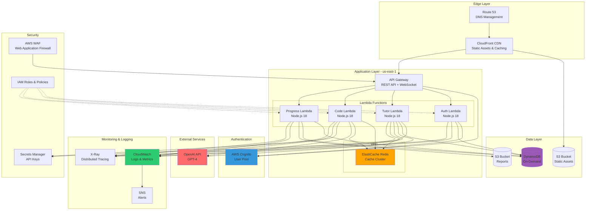


### AWS Services Configuration

#### Lambda Functions

**Configuration:**
- Runtime: Node.js 18.x
- Memory: 1024 MB (tunable based on load)
- Timeout: 30 seconds (API Gateway max)
- Concurrency: Reserved concurrency per function
- Environment Variables: Encrypted with KMS

**Deployment:**
- Packaged with dependencies using Lambda Layers
- Deployed via AWS SAM or Serverless Framework
- Blue/Green deployments for zero downtime
- Versioning and aliases for rollback capability

#### API Gateway

**Configuration:**
- Type: REST API with WebSocket support
- Throttling: 10,000 requests per second
- Burst: 5,000 requests
- Caching: Enabled for GET endpoints (5-minute TTL)
- CORS: Enabled for web client
- Custom domain with SSL certificate

**Security:**
- AWS WAF rules for common attacks
- API keys for rate limiting
- JWT token validation via Cognito authorizer
- Request/response validation

#### DynamoDB

**Configuration:**
- Billing Mode: On-Demand (pay per request)
- Point-in-time recovery: Enabled
- Encryption at rest: Enabled (AWS managed keys)
- Global Secondary Indexes (GSI):
  - email-index on Users table
  - userId-index on Quizzes and Sessions tables
- Time-to-Live (TTL): Enabled on Sessions table

**Performance:**
- Auto-scaling for provisioned capacity (if switched)
- DynamoDB Accelerator (DAX) for read-heavy workloads (optional)
- Batch operations for bulk reads/writes

#### ElastiCache (Redis)

**Configuration:**
- Node Type: cache.t3.medium (2 vCPU, 3.09 GB)
- Cluster Mode: Enabled for horizontal scaling
- Replication: Multi-AZ with automatic failover
- Encryption: In-transit and at-rest
- Backup: Daily automated snapshots

**Cache Strategy:**
- TTL: 5 minutes for dashboard data
- TTL: 1 hour for concept explanations
- TTL: 30 minutes for user skill profiles
- Cache invalidation on data updates

#### S3 Buckets

**Static Assets Bucket:**
- Versioning: Enabled
- Lifecycle: Transition to Glacier after 90 days
- CloudFront distribution for CDN
- Public read access with bucket policy

**Reports Bucket:**
- Versioning: Enabled
- Encryption: SSE-S3
- Lifecycle: Delete after 30 days
- Pre-signed URLs for secure access
- Private access only

#### Cognito User Pool

**Configuration:**
- Password Policy: Min 8 chars, uppercase, lowercase, number, special char
- MFA: Optional (TOTP or SMS)
- Email Verification: Required
- Token Expiration: Access token 1 hour, Refresh token 30 days
- Custom attributes: learningGoals, preferredLanguages

**Security:**
- Advanced security features enabled
- Compromised credentials check
- Account takeover protection
- Adaptive authentication


## Error Handling

### Error Categories

1. **Client Errors (4xx)**
   - 400 Bad Request: Invalid input data
   - 401 Unauthorized: Missing or invalid authentication
   - 403 Forbidden: Insufficient permissions
   - 404 Not Found: Resource doesn't exist
   - 429 Too Many Requests: Rate limit exceeded

2. **Server Errors (5xx)**
   - 500 Internal Server Error: Unexpected server error
   - 502 Bad Gateway: Upstream service failure
   - 503 Service Unavailable: Service temporarily down
   - 504 Gateway Timeout: Request timeout

3. **External Service Errors**
   - OpenAI API failures
   - AWS service outages
   - Network connectivity issues

### Error Response Format

```typescript
interface ErrorResponse {
  error: {
    code: string;           // Machine-readable error code
    message: string;        // Human-readable error message
    details?: any;          // Additional error context
    timestamp: string;      // ISO 8601 timestamp
    requestId: string;      // Unique request identifier for tracking
  };
}
```

**Example:**
```json
{
  "error": {
    "code": "INVALID_QUIZ_ANSWER",
    "message": "The submitted answer format is invalid",
    "details": {
      "field": "answers",
      "expected": "array of objects",
      "received": "string"
    },
    "timestamp": "2024-01-15T10:30:00Z",
    "requestId": "req_abc123xyz"
  }
}
```

### Error Handling Strategy

#### 1. Input Validation
- Validate all inputs at API Gateway level
- Use JSON Schema validation
- Return 400 with specific field errors
- Sanitize inputs to prevent injection attacks

#### 2. Authentication Errors
- Return 401 for missing/invalid tokens
- Return 403 for insufficient permissions
- Log authentication failures for security monitoring
- Implement exponential backoff for repeated failures

#### 3. Rate Limiting
- Implement per-user rate limits
- Return 429 with Retry-After header
- Use token bucket algorithm
- Different limits for different endpoints

#### 4. External Service Failures
- Implement circuit breaker pattern
- Retry with exponential backoff (max 3 attempts)
- Fallback to cached responses when available
- Return 503 when service is unavailable

#### 5. Database Errors
- Handle DynamoDB throttling with retries
- Implement optimistic locking for concurrent updates
- Log all database errors to CloudWatch
- Return 500 for unexpected database errors

#### 6. Timeout Handling
- Set appropriate timeouts for all operations
- OpenAI API: 25 seconds
- Database operations: 5 seconds
- Cache operations: 1 second
- Return 504 for timeout errors

### Logging and Monitoring

**CloudWatch Logs:**
- Structured JSON logging
- Log levels: ERROR, WARN, INFO, DEBUG
- Include request ID in all logs
- Sensitive data redaction

**CloudWatch Metrics:**
- API request count and latency
- Error rates by type
- Lambda invocation metrics
- DynamoDB read/write capacity
- Cache hit/miss rates
- OpenAI API usage and costs

**Alarms:**
- Error rate > 5% for 5 minutes
- API latency > 2 seconds (p95)
- Lambda throttling events
- DynamoDB throttling events
- Cache cluster CPU > 75%

**X-Ray Tracing:**
- End-to-end request tracing
- Service map visualization
- Performance bottleneck identification
- Error analysis and debugging


## Security Design

### Authentication & Authorization

**JWT Token Structure:**
```typescript
interface JWTPayload {
  sub: string;              // User ID
  email: string;
  iat: number;              // Issued at
  exp: number;              // Expiration
  scope: string[];          // Permissions
}
```

**Authorization Levels:**
- User: Standard access to all features
- Admin: Access to user management and analytics
- System: Internal service-to-service communication

### Data Security

#### Encryption

**In Transit:**
- TLS 1.3 for all API communications
- Certificate pinning for mobile apps
- Encrypted WebSocket connections

**At Rest:**
- DynamoDB encryption with AWS managed keys
- S3 server-side encryption (SSE-S3)
- ElastiCache encryption enabled
- Secrets Manager for API keys and credentials

#### Data Privacy

**PII Protection:**
- Minimal PII collection
- Email hashing for analytics
- No storage of user code without consent
- GDPR compliance for EU users
- Data retention policies (30 days for code history)

**Access Controls:**
- Row-level security in DynamoDB
- IAM roles with least privilege
- VPC for ElastiCache isolation
- S3 bucket policies for restricted access

### Input Validation & Sanitization

**API Input Validation:**
```typescript
// Example validation schema
const explainRequestSchema = {
  type: 'object',
  required: ['topic'],
  properties: {
    topic: {
      type: 'string',
      minLength: 1,
      maxLength: 200,
      pattern: '^[a-zA-Z0-9\\s\\-_]+$'
    },
    context: {
      type: 'string',
      maxLength: 1000
    }
  }
};
```

**Code Input Sanitization:**
- Remove potentially malicious code patterns
- Limit code size (max 10,000 characters)
- Timeout code analysis operations
- Sandbox code execution (if implemented)

### Rate Limiting

**Per-User Limits:**
- Concept explanations: 50/hour
- Quiz generation: 20/hour
- Code generation: 30/hour
- Code review: 20/hour
- API requests: 1000/hour

**Implementation:**
- Token bucket algorithm
- Redis-based rate limiting
- Per-endpoint granular limits
- Burst allowance for legitimate spikes

### Security Headers

```typescript
const securityHeaders = {
  'Strict-Transport-Security': 'max-age=31536000; includeSubDomains',
  'X-Content-Type-Options': 'nosniff',
  'X-Frame-Options': 'DENY',
  'X-XSS-Protection': '1; mode=block',
  'Content-Security-Policy': "default-src 'self'; script-src 'self' 'unsafe-inline'",
  'Referrer-Policy': 'strict-origin-when-cross-origin'
};
```

### Vulnerability Protection

**AWS WAF Rules:**
- SQL injection protection
- XSS attack prevention
- Rate-based rules for DDoS mitigation
- IP reputation lists
- Geographic restrictions (if needed)

**Dependency Management:**
- Regular npm audit scans
- Automated dependency updates
- Snyk integration for vulnerability scanning
- Lock file verification

### Incident Response

**Security Monitoring:**
- Failed authentication attempts
- Unusual API usage patterns
- Privilege escalation attempts
- Data access anomalies

**Incident Response Plan:**
1. Detection via CloudWatch alarms
2. Automated SNS notifications
3. Immediate investigation
4. Containment (disable accounts, revoke tokens)
5. Remediation and patching
6. Post-incident review


## Performance Optimization

### Caching Strategy

#### Multi-Layer Caching

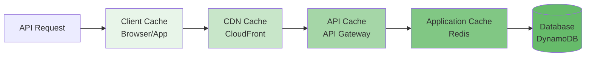

**Cache Levels:**

1. **Client-Side Cache (Browser/App)**
   - Static assets: 1 year
   - API responses: 5 minutes
   - User preferences: Session storage

2. **CDN Cache (CloudFront)**
   - Static assets: 24 hours
   - API responses: 1 minute (for cacheable endpoints)
   - Geographic distribution for low latency

3. **API Gateway Cache**
   - GET endpoints: 5 minutes
   - Reduced Lambda invocations
   - Cost optimization

4. **Application Cache (Redis)**
   - User skill profiles: 30 minutes
   - Concept explanations: 1 hour
   - Dashboard data: 5 minutes
   - Quiz templates: 2 hours

### Database Optimization

**DynamoDB Best Practices:**
- Use composite keys for efficient queries
- Implement GSIs for alternate access patterns
- Batch operations for multiple items
- Consistent reads only when necessary
- Projection expressions to fetch only needed attributes

**Query Patterns:**
```typescript
// Efficient: Get user with skill profiles in one query
const params = {
  TableName: 'SkillProfiles',
  KeyConditionExpression: 'userId = :userId',
  ExpressionAttributeValues: {
    ':userId': userId
  }
};

// Use batch get for multiple items
const batchParams = {
  RequestItems: {
    'Users': {
      Keys: userIds.map(id => ({ userId: id }))
    }
  }
};
```

### Lambda Optimization

**Cold Start Mitigation:**
- Provisioned concurrency for critical functions
- Minimize package size (< 50 MB)
- Use Lambda Layers for shared dependencies
- Keep functions warm with scheduled pings

**Memory Optimization:**
- Right-size memory allocation (1024 MB baseline)
- Monitor memory usage via CloudWatch
- Increase memory for CPU-intensive operations
- Use streaming for large responses

**Code Optimization:**
```typescript
// Reuse connections across invocations
let dbClient;
let redisClient;

export const handler = async (event) => {
  // Initialize clients outside handler for reuse
  if (!dbClient) {
    dbClient = new DynamoDBClient({});
  }
  if (!redisClient) {
    redisClient = await createRedisClient();
  }
  
  // Handler logic
};
```

### API Response Optimization

**Pagination:**
```typescript
interface PaginatedResponse<T> {
  data: T[];
  pagination: {
    nextToken?: string;
    hasMore: boolean;
    total?: number;
  };
}
```

**Compression:**
- Enable gzip compression at API Gateway
- Reduce payload size by 70-80%
- Automatic for responses > 1 KB

**Field Selection:**
```typescript
// Allow clients to specify needed fields
GET /api/progress/dashboard?fields=metrics,achievements
```

### OpenAI API Optimization

**Cost Reduction:**
- Cache common explanations
- Use GPT-3.5-turbo for simple tasks
- Use GPT-4 only for complex analysis
- Implement token limits per request
- Batch similar requests when possible

**Performance:**
- Streaming responses for long content
- Parallel requests for independent operations
- Timeout and retry logic
- Fallback to cached content on failure

**Token Management:**
```typescript
const tokenLimits = {
  'explain': 2000,        // Concept explanations
  'quiz': 1500,           // Quiz generation
  'code-generate': 2500,  // Code generation
  'code-review': 3000,    // Code review
  'debug': 2000           // Debugging assistance
};
```

### Monitoring Performance

**Key Metrics:**
- API response time (p50, p95, p99)
- Lambda duration and cold starts
- DynamoDB read/write latency
- Cache hit rates
- OpenAI API latency and costs

**Performance Targets:**
- API response time: < 2 seconds (p95)
- Lambda cold start: < 1 second
- Database queries: < 100ms
- Cache hit rate: > 80%
- OpenAI API: < 5 seconds


## Scalability Design

### Horizontal Scaling

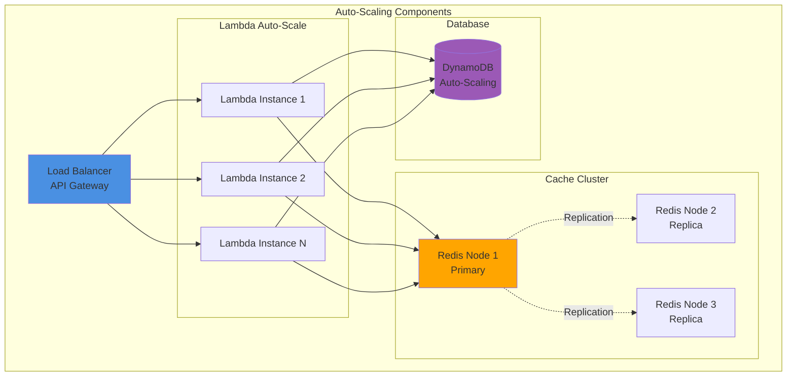

### Scaling Strategies

#### Lambda Scaling
- **Concurrent Executions**: Up to 1000 per region (default)
- **Reserved Concurrency**: Allocate per function to prevent throttling
- **Provisioned Concurrency**: Keep functions warm during peak hours
- **Burst Capacity**: 500-3000 additional concurrent executions

**Scaling Configuration:**
```yaml
functions:
  tutorService:
    reservedConcurrency: 100
    provisionedConcurrency: 10  # During peak hours
  codeService:
    reservedConcurrency: 100
    provisionedConcurrency: 10
  progressService:
    reservedConcurrency: 50
```

#### DynamoDB Scaling
- **On-Demand Mode**: Automatic scaling based on traffic
- **Provisioned Mode**: Auto-scaling with target utilization
- **Burst Capacity**: Unused capacity accumulated for spikes

**Auto-Scaling Policy:**
```yaml
autoScaling:
  read:
    targetUtilization: 70
    minCapacity: 5
    maxCapacity: 1000
  write:
    targetUtilization: 70
    minCapacity: 5
    maxCapacity: 500
```

#### ElastiCache Scaling
- **Cluster Mode**: Horizontal scaling with sharding
- **Replication**: Multi-AZ with read replicas
- **Node Types**: Upgrade to larger instances as needed

**Scaling Triggers:**
- CPU utilization > 75%
- Memory utilization > 80%
- Network throughput > 70%

### Load Distribution

**Geographic Distribution:**
- Primary Region: us-east-1
- Secondary Region: eu-west-1 (future)
- CloudFront edge locations worldwide

**Traffic Routing:**
- Route 53 latency-based routing
- Health checks for automatic failover
- Weighted routing for gradual rollouts

### Capacity Planning

**User Growth Projections:**

| Metric | Month 1 | Month 3 | Month 6 | Month 12 |
|--------|---------|---------|---------|----------|
| Active Users | 100 | 500 | 2,000 | 10,000 |
| Daily Requests | 10K | 50K | 200K | 1M |
| Storage (GB) | 1 | 10 | 50 | 250 |
| Monthly Cost | $50 | $200 | $800 | $3,500 |

**Resource Allocation:**
- Lambda: 1000 concurrent executions (sufficient for 10K users)
- DynamoDB: On-demand (handles variable load)
- ElastiCache: 3-node cluster (6 GB total memory)
- S3: Unlimited storage with lifecycle policies

### Cost Optimization

**Strategies:**
1. Use on-demand pricing for variable workloads
2. Implement aggressive caching to reduce API calls
3. Use Lambda Layers to reduce deployment size
4. Archive old data to S3 Glacier
5. Monitor and optimize OpenAI API usage
6. Use CloudWatch Logs Insights instead of third-party tools

**Cost Breakdown (Estimated for 1000 active users):**
- Lambda: $50/month
- DynamoDB: $30/month
- ElastiCache: $50/month
- API Gateway: $20/month
- S3: $10/month
- CloudFront: $15/month
- OpenAI API: $100/month
- Other AWS services: $25/month
- **Total: ~$300/month**


## Testing Strategy

### Testing Pyramid

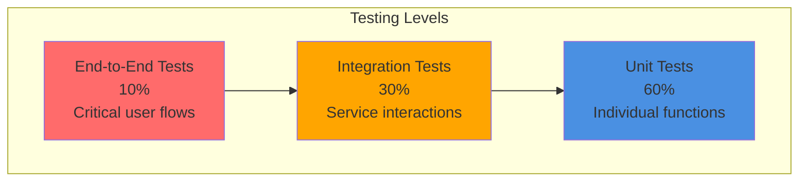

### Unit Testing

**Framework:** Jest with TypeScript

**Coverage Targets:**
- Overall: 80% code coverage
- Critical paths: 95% coverage
- Utility functions: 100% coverage

**Example Test:**
```typescript
describe('AdaptiveLearningEngine', () => {
  describe('adjustContentComplexity', () => {
    it('should simplify content for low skill level', () => {
      const engine = new AdaptiveLearningEngine();
      const content = 'Advanced binary tree traversal algorithms...';
      const skillLevel = { level: 2, topic: 'data-structures' };
      
      const adjusted = engine.adjustContentComplexity(content, skillLevel);
      
      expect(adjusted).toContain('simple');
      expect(adjusted).not.toContain('advanced');
    });
    
    it('should maintain complexity for high skill level', () => {
      const engine = new AdaptiveLearningEngine();
      const content = 'Advanced binary tree traversal algorithms...';
      const skillLevel = { level: 8, topic: 'data-structures' };
      
      const adjusted = engine.adjustContentComplexity(content, skillLevel);
      
      expect(adjusted).toBe(content);
    });
  });
});
```

### Integration Testing

**Framework:** Jest with AWS SDK mocks

**Test Scenarios:**
- Service-to-service communication
- Database operations
- Cache interactions
- External API calls (mocked)

**Example Test:**
```typescript
describe('TutorService Integration', () => {
  let tutorService: TutorService;
  let mockDynamoDB: jest.Mocked<DynamoDBClient>;
  let mockRedis: jest.Mocked<RedisClient>;
  
  beforeEach(() => {
    mockDynamoDB = createMockDynamoDB();
    mockRedis = createMockRedis();
    tutorService = new TutorService(mockDynamoDB, mockRedis);
  });
  
  it('should generate quiz and store in database', async () => {
    const userId = 'user123';
    const topic = 'algorithms';
    
    const quiz = await tutorService.generateQuiz(userId, topic, 3);
    
    expect(quiz.questions).toHaveLength(5);
    expect(mockDynamoDB.putItem).toHaveBeenCalledWith(
      expect.objectContaining({
        TableName: 'Quizzes',
        Item: expect.objectContaining({
          quizId: expect.any(String),
          userId: userId
        })
      })
    );
  });
});
```

### End-to-End Testing

**Framework:** Playwright or Cypress

**Test Scenarios:**
- Complete user registration and login flow
- Learning flow: explanation → quiz → feedback
- Code assistance flow: generate → review
- Progress tracking and dashboard

**Example Test:**
```typescript
describe('Learning Flow E2E', () => {
  it('should complete full learning cycle', async () => {
    // Login
    await page.goto('/login');
    await page.fill('[name="email"]', 'test@example.com');
    await page.fill('[name="password"]', 'Test123!');
    await page.click('button[type="submit"]');
    
    // Request explanation
    await page.goto('/learn');
    await page.fill('[name="topic"]', 'Binary Search');
    await page.click('button:has-text("Explain")');
    await expect(page.locator('.explanation')).toBeVisible();
    
    // Take quiz
    await page.click('button:has-text("Take Quiz")');
    await page.click('[data-question="0"] [data-answer="2"]');
    await page.click('[data-question="1"] [data-answer="1"]');
    await page.click('button:has-text("Submit")');
    
    // Verify feedback
    await expect(page.locator('.quiz-score')).toContainText('2/2');
    await expect(page.locator('.feedback')).toBeVisible();
  });
});
```

### Load Testing

**Framework:** Artillery or k6

**Test Scenarios:**
- Ramp-up: 0 to 1000 users over 5 minutes
- Sustained load: 1000 concurrent users for 10 minutes
- Spike test: Sudden increase to 2000 users
- Stress test: Find breaking point

**Example Configuration:**
```yaml
config:
  target: 'https://api.aimentor.com'
  phases:
    - duration: 300
      arrivalRate: 10
      rampTo: 100
      name: "Ramp up"
    - duration: 600
      arrivalRate: 100
      name: "Sustained load"
  
scenarios:
  - name: "Learning Flow"
    weight: 50
    flow:
      - post:
          url: "/api/auth/login"
          json:
            email: "{{ $randomEmail }}"
            password: "Test123!"
      - post:
          url: "/api/tutor/explain"
          json:
            topic: "{{ $randomTopic }}"
      - post:
          url: "/api/tutor/quiz/generate"
          json:
            topic: "{{ $randomTopic }}"
```

### Security Testing

**Tools:**
- OWASP ZAP for vulnerability scanning
- npm audit for dependency vulnerabilities
- AWS Inspector for infrastructure security
- Snyk for continuous monitoring

**Test Areas:**
- SQL injection attempts
- XSS attacks
- CSRF protection
- Authentication bypass
- Authorization escalation
- Rate limiting effectiveness

### Continuous Integration

**CI/CD Pipeline:**
```mermaid
graph LR
    Commit[Git Commit] --> Build[Build & Lint]
    Build --> Unit[Unit Tests]
    Unit --> Integration[Integration Tests]
    Integration --> Security[Security Scan]
    Security --> Deploy[Deploy to Staging]
    Deploy --> E2E[E2E Tests]
    E2E --> Approve[Manual Approval]
    Approve --> Prod[Deploy to Production]
    
    style Commit fill:#4A90E2
    style Prod fill:#2ECC71
```

**GitHub Actions Workflow:**
```yaml
name: CI/CD Pipeline

on:
  push:
    branches: [main, develop]
  pull_request:
    branches: [main]

jobs:
  test:
    runs-on: ubuntu-latest
    steps:
      - uses: actions/checkout@v3
      - uses: actions/setup-node@v3
        with:
          node-version: '18'
      - run: npm ci
      - run: npm run lint
      - run: npm run test:unit
      - run: npm run test:integration
      - run: npm run test:security
      
  deploy-staging:
    needs: test
    if: github.ref == 'refs/heads/develop'
    runs-on: ubuntu-latest
    steps:
      - uses: actions/checkout@v3
      - run: npm run deploy:staging
      - run: npm run test:e2e
      
  deploy-production:
    needs: test
    if: github.ref == 'refs/heads/main'
    runs-on: ubuntu-latest
    steps:
      - uses: actions/checkout@v3
      - run: npm run deploy:production
```


## Future Enhancements

### Phase 2 Features (3-6 months)

1. **Collaborative Learning**
   - Study groups and peer learning
   - Shared progress tracking
   - Group quizzes and competitions
   - Leaderboards and achievements

2. **Advanced AI Capabilities**
   - Voice-based interactions
   - Image recognition for diagrams
   - Video content generation
   - Interactive coding environments

3. **Mobile Applications**
   - Native iOS app
   - Native Android app
   - Offline mode support
   - Push notifications

4. **Enhanced Analytics**
   - Learning pattern analysis
   - Predictive skill assessment
   - Personalized learning paths
   - A/B testing for content effectiveness


### Phase 3 Features (6-12 months)

1. **Enterprise Features**
   - Team management and administration
   - Custom learning paths for organizations
   - Integration with corporate LMS
   - Advanced reporting and analytics
   - SSO integration (SAML, OAuth)

2. **Content Marketplace**
   - User-generated learning content
   - Expert-created courses
   - Certification programs
   - Monetization options

3. **Advanced Code Features**
   - Real-time pair programming
   - Code execution sandbox
   - Project-based learning
   - Integration with GitHub/GitLab
   - CI/CD pipeline integration

4. **AI Model Improvements**
   - Fine-tuned models for specific domains
   - Multi-modal learning (text, code, diagrams)
   - Improved context awareness
   - Better error detection and suggestions


### Technology Roadmap

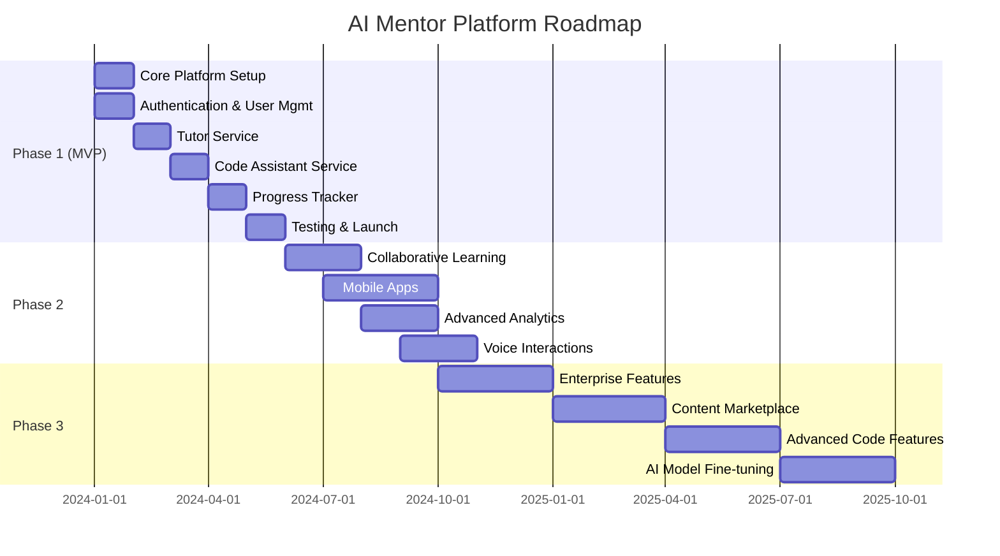


## Deployment Strategy

### Environment Setup

**Environments:**
1. **Development**: Local development with LocalStack for AWS services
2. **Staging**: AWS environment mirroring production
3. **Production**: Full AWS deployment with monitoring

### Infrastructure as Code

**AWS SAM Template Example:**
```yaml
AWSTemplateFormatVersion: '2010-09-09'
Transform: AWS::Serverless-2016-10-31

Globals:
  Function:
    Runtime: nodejs18.x
    Timeout: 30
    MemorySize: 1024
    Environment:
      Variables:
        DYNAMODB_TABLE: !Ref UsersTable
        REDIS_ENDPOINT: !GetAtt RedisCluster.RedisEndpoint.Address
        OPENAI_API_KEY: !Sub '{{resolve:secretsmanager:OpenAIKey}}'

Resources:
  # API Gateway
  ApiGateway:
    Type: AWS::Serverless::Api
    Properties:
      StageName: prod
      Auth:
        DefaultAuthorizer: CognitoAuthorizer
        Authorizers:
          CognitoAuthorizer:
            UserPoolArn: !GetAtt UserPool.Arn
      Cors:
        AllowOrigin: "'*'"
        AllowHeaders: "'*'"
        AllowMethods: "'*'"

  # Lambda Functions
  TutorFunction:
    Type: AWS::Serverless::Function
    Properties:
      CodeUri: src/tutor/
      Handler: index.handler
      Events:
        ExplainApi:
          Type: Api
          Properties:
            RestApiId: !Ref ApiGateway
            Path: /api/tutor/explain
            Method: POST
      Policies:
        - DynamoDBCrudPolicy:
            TableName: !Ref UsersTable
        - VPCAccessPolicy: {}

  # DynamoDB Tables
  UsersTable:
    Type: AWS::DynamoDB::Table
    Properties:
      TableName: Users
      BillingMode: PAY_PER_REQUEST
      AttributeDefinitions:
        - AttributeName: userId
          AttributeType: S
        - AttributeName: email
          AttributeType: S
      KeySchema:
        - AttributeName: userId
          KeyType: HASH
      GlobalSecondaryIndexes:
        - IndexName: email-index
          KeySchema:
            - AttributeName: email
              KeyType: HASH
          Projection:
            ProjectionType: ALL
      PointInTimeRecoverySpecification:
        PointInTimeRecoveryEnabled: true

  # Cognito User Pool
  UserPool:
    Type: AWS::Cognito::UserPool
    Properties:
      UserPoolName: AIMentorUsers
      AutoVerifiedAttributes:
        - email
      Policies:
        PasswordPolicy:
          MinimumLength: 8
          RequireUppercase: true
          RequireLowercase: true
          RequireNumbers: true
          RequireSymbols: true

  # ElastiCache Redis
  RedisCluster:
    Type: AWS::ElastiCache::ReplicationGroup
    Properties:
      ReplicationGroupDescription: AI Mentor Cache
      Engine: redis
      CacheNodeType: cache.t3.medium
      NumCacheClusters: 3
      AutomaticFailoverEnabled: true
      MultiAZEnabled: true
      AtRestEncryptionEnabled: true
      TransitEncryptionEnabled: true
```


### Deployment Process


**Deployment Steps:**

1. **Pre-Deployment**
   - Run all tests locally
   - Update version numbers
   - Update CHANGELOG.md
   - Create deployment checklist

2. **Staging Deployment**
   ```bash
   npm run build
   npm run test
   sam build
   sam deploy --config-env staging
   npm run test:e2e:staging
   ```

3. **Production Deployment**
   ```bash
   sam deploy --config-env production
   npm run smoke-test:production
   ```

4. **Post-Deployment**
   - Verify all services are healthy
   - Check CloudWatch metrics
   - Monitor error rates
   - Test critical user flows
   - Update status page

5. **Rollback Plan**
   ```bash
   # Rollback to previous version
   sam deploy --config-env production --parameter-overrides Version=previous
   
   # Or use Lambda aliases
   aws lambda update-alias \
     --function-name TutorFunction \
     --name prod \
     --function-version $PREVIOUS_VERSION
   ```

### Blue/Green Deployment

**Strategy:**
- Deploy new version alongside existing version
- Gradually shift traffic using weighted routing
- Monitor metrics during transition
- Automatic rollback on error threshold

**Traffic Shifting:**
```yaml
DeploymentPreference:
  Type: Canary10Percent5Minutes
  Alarms:
    - !Ref ErrorRateAlarm
    - !Ref LatencyAlarm
  Hooks:
    PreTraffic: !Ref PreTrafficHook
    PostTraffic: !Ref PostTrafficHook
```


## Disaster Recovery

### Backup Strategy

**DynamoDB:**
- Point-in-time recovery enabled
- Daily automated backups
- Retention: 35 days
- Cross-region replication (future)

**S3:**
- Versioning enabled
- Cross-region replication
- Lifecycle policies for archival
- Glacier for long-term storage

**ElastiCache:**
- Daily automated snapshots
- Retention: 7 days
- Manual snapshots before major changes

### Recovery Procedures

**RTO (Recovery Time Objective):** 1 hour
**RPO (Recovery Point Objective):** 5 minutes

**Disaster Scenarios:**

1. **Lambda Function Failure**
   - Automatic retry with exponential backoff
   - Rollback to previous version
   - RTO: 5 minutes

2. **Database Corruption**
   - Restore from point-in-time backup
   - Verify data integrity
   - RTO: 30 minutes

3. **Region Outage**
   - Failover to secondary region (future)
   - Update DNS records
   - RTO: 1 hour

4. **Complete System Failure**
   - Restore from backups
   - Rebuild infrastructure from IaC
   - RTO: 4 hours

### Monitoring and Alerts

**Critical Alarms:**
- API error rate > 5%
- Lambda throttling events
- DynamoDB throttling
- Cache cluster failure
- OpenAI API failures

**Alert Channels:**
- SNS → Email
- SNS → Slack
- SNS → PagerDuty (for critical issues)

**On-Call Rotation:**
- 24/7 on-call engineer
- Escalation path defined
- Runbook for common issues


## Compliance and Legal

### Data Privacy

**GDPR Compliance:**
- Right to access: API endpoint for data export
- Right to erasure: Data deletion within 30 days
- Right to portability: JSON export of all user data
- Consent management: Explicit opt-in for data processing
- Data minimization: Collect only necessary information

**CCPA Compliance:**
- Privacy policy disclosure
- Opt-out mechanism for data sale (N/A - we don't sell data)
- Data access requests within 45 days

### Terms of Service

**Key Points:**
- User-generated content ownership
- Platform usage restrictions
- Liability limitations
- Service availability disclaimers
- Termination conditions

### Acceptable Use Policy

**Prohibited Activities:**
- Malicious code submission
- Abuse of AI services
- Unauthorized access attempts
- Spam or harassment
- Copyright infringement

### Data Retention

**Retention Periods:**
- User accounts: Until deletion request
- Progress data: Lifetime of account
- Code history: 30 days
- Logs: 90 days
- Backups: 35 days


## Conclusion

The AI Mentor Platform design provides a comprehensive, scalable, and secure solution for personalized learning and developer productivity. The architecture leverages modern cloud-native technologies and best practices to deliver:

- **Adaptive Learning**: AI-powered content that adjusts to individual skill levels
- **Developer Productivity**: Intelligent code assistance for writing, debugging, and optimization
- **Progress Tracking**: Comprehensive analytics and insights into learning journey
- **Scalability**: Serverless architecture that scales automatically with demand
- **Security**: Enterprise-grade security with encryption, authentication, and compliance
- **Performance**: Sub-2-second response times with multi-layer caching
- **Cost Efficiency**: Pay-per-use pricing model optimized for variable workloads

### Key Success Metrics

**User Engagement:**
- Daily active users (DAU)
- Average session duration
- Quiz completion rate
- Code assistance usage

**Learning Outcomes:**
- Skill level improvements
- Learning gap resolution rate
- Topic completion rate
- User satisfaction scores

**Technical Performance:**
- API response time (p95 < 2s)
- System uptime (99.9%)
- Error rate (< 1%)
- Cache hit rate (> 80%)

**Business Metrics:**
- User acquisition cost
- Monthly recurring revenue
- Customer lifetime value
- Churn rate

### Next Steps

1. **MVP Development** (Months 1-6)
   - Implement core services
   - Deploy to staging environment
   - Conduct beta testing
   - Launch to production

2. **User Feedback** (Months 6-9)
   - Gather user feedback
   - Iterate on features
   - Optimize performance
   - Improve AI models

3. **Scale and Expand** (Months 9-12)
   - Add Phase 2 features
   - Expand to mobile platforms
   - Implement enterprise features
   - Grow user base

This design document serves as the blueprint for building a world-class AI-powered learning and development platform that empowers developers to learn faster, code better, and achieve their goals.

